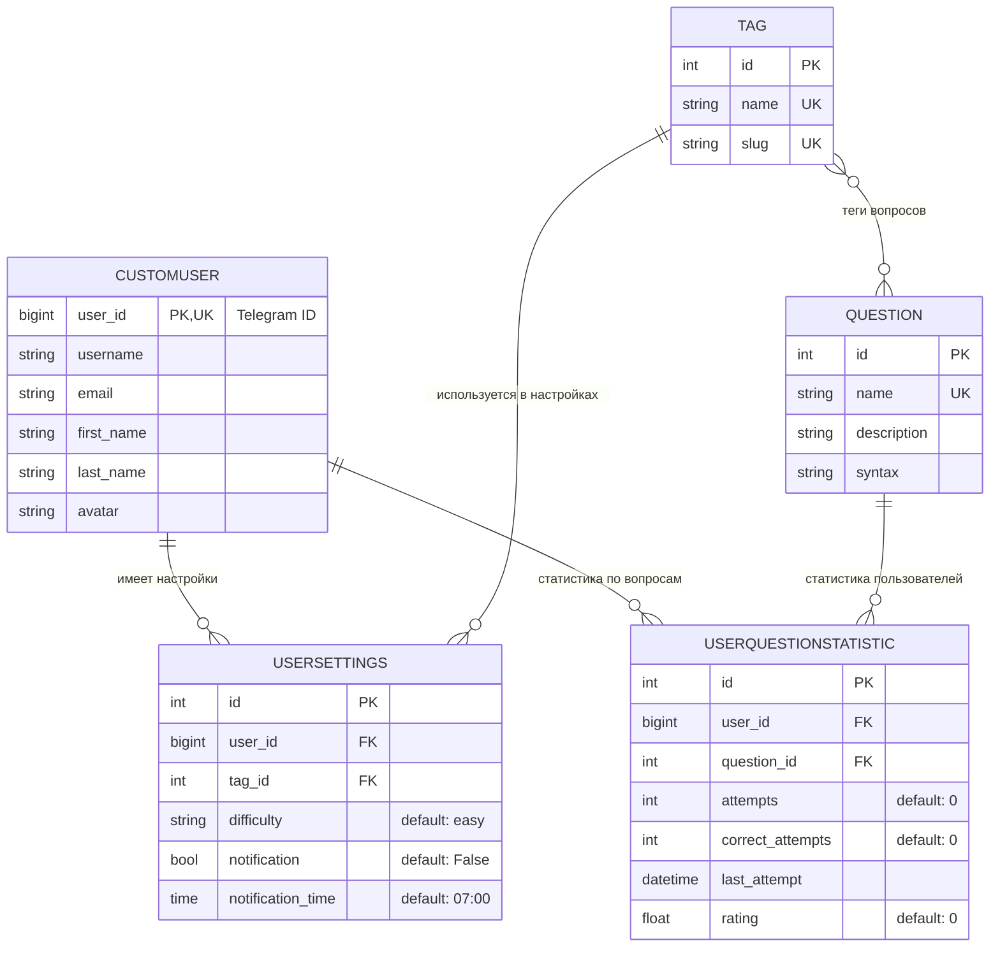

/**
 * @file: models_er_diagram.md
 * @description: ER-диаграмма связей моделей Django-приложения (CustomUser, Tag, Question, UserSettings, UserQuestionStatistic)
 * @dependencies: backend/bot/models.py
 * @created: 2025-05-24
 */

---

---

_Диаграмма отражает все основные связи, уникальные и внешние ключи, а также типы и дефолты полей. Для актуализации — обновлять при изменении моделей._
